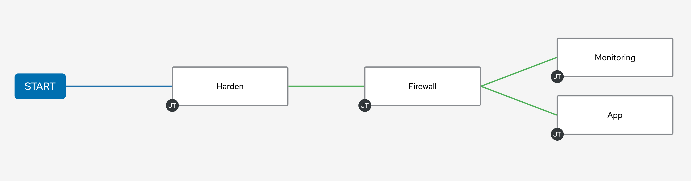

🔐 Login credentials
===
All the logins use the same credentials.

>**Username**:
> ```yaml
>student
>```
>**Password**:
>```yaml
>learn_ansible
>```

👋 Introduction
===

Congratulations on finishing the lab!

The playground has fewer step-by-step instructions and no checks, so feel free to explore.
Here are a few challenges you can try.

ℹ️ Need help?
===

* You can expand the images by clicking on them for a closer look.
* Solution playbooks are located under the *solution_playbooks* folder in Visual Studio Code, in the RHEL tab.

### How do I generate Ansible Lightspeed suggestions?

- Navigate to the end of the Ansible task description line.
* Uncomment the task description line by manually removing the `#`, or press `Ctrl + /`.
- At the end of the Ansible task description, press `ENTER` and once a suggestion is generated, press `TAB` to accept it.

👍 Good luck!

☑️ Task - Generate Playbook tasks to deploy `Cockpit` application.
===

* Install `cockpit` and `cockpit-podman` applications.
* Start and enable the `cockpit` service.
* Wait for port `9090` availability.

☑️ Task - Recreate the controller Workflow
===

* Create the `Deploy app workflow` Workflow Template based on the screenshot above.

>**ℹ️ Hint**
>
> Need help? Run the `🚀 Solve - Create workflow` Template in the controller tab to create `Deploy app workflow`.

✏️ Feedback
===

**We would love your feedback!**

* Please take the [Ansible Lightspeed Beta sentiment survey](https://red.ht/ansible-ai-feedback).
* Reach out to us at <ansible-content-ai@redhat.com>.

You can also use the *Take Survey* or *Contact Us* buttons by clicking on Lightspeed at the bottom right of the Visual Studio Code window at any time.

<a href="#vscode_survey">
  
</a>

<a href="#" class="lightbox" id="#vscode_survey">
  
</a>

👏 Close the lab
===

Press the `Next` button to close the lab.

✅ Additional resources
===

[More information](https://www.redhat.com/en/engage/project-wisdom) on Ansible Lightspeed Tech Preview.

Explore free resources to get you started:

* [Self-paced exercises](https://www.redhat.com/en/engage/redhat-ansible-automation-202108061218) - Explore all our self-paced labs
* [Trial subscription](http://red.ht/try_ansible) - Are you ready to install in your environment? Get your trial subscription for unlimited access to all the components of Ansible Automation Platform.
* Subscribe to the Red Hat Ansible Automation Platform YouTube channel.

🐛 Encountered an issue?
====

If you have encountered an issue or have noticed something not quite right, please [open an issue](https://github.com/ansible/instruqt/issues/new?labels=getting-started-mesh&title=Getting+started+with+Ansible+Lightspeed+-+issue&assignees=craig-br).

<style type="text/css" rel="stylesheet">
  .lightbox {
    display: none;
    position: fixed;
    justify-content: center;
    align-items: center;
    z-index: 999;
    top: 0;
    left: 0;
    right: 0;
    bottom: 0;
    padding: 1rem;
    background: rgba(0, 0, 0, 0.8);
    margin-left: auto;
    margin-right: auto;
    margin-top: auto;
    margin-bottom: auto;
  }
  .lightbox:target {
    display: flex;
  }
  .lightbox img {
    max-width: 60%;
    max-height: 60%;
  }
  html {
    font-size: 14px;
  }
  img {
    display: block;
    margin-left: auto;
    margin-right: auto;
  }
  h1 {
    font-size: 18px;
  }
  h2 {
    font-size: 16px;
    font-weight: 600
  }
  h3 {
    font-size: 14px;
    font-weight: 600
  }
  p {
    font-size: 14px;
  }
  p span {
    font-size: 14px;
  }
  ul li span {
    font-size: 14px
  }
</style>
