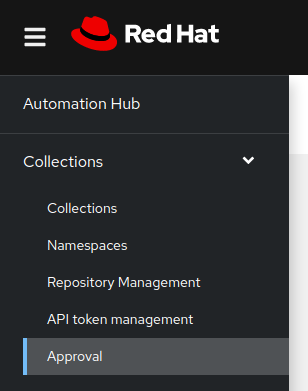
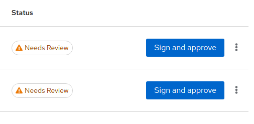
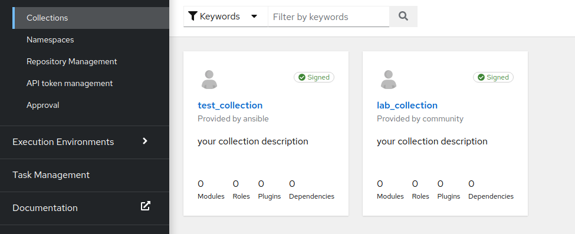

In this challenge we will sign and approve the published Ansible Content Collection, the only tab available for this challenge is `automationhub-web`, as the private automation hub is enabled to stage any incoming collections for signing and approval.
Go through the following steps:
***

## 1. Login to private automation hub instance in the automationhub-ui tab using below credentials:
```
Username: admin
Password: ansible123!
```
***
## 2. Once you are logged in, click the Collections `>` Approval from the Navigator Pane on the left hand side:


***
## 3. As we published the collections in the last exercise, In the Approval page you will now see the **Sign and approve** button in front of both the collections that we pushed.
Click on the **Sign and approve** button for both the collections.

***
## 4. You have now signed and published both collections, they will now show up in the **Collections** page as signed.

***
## 5. Congratulations! Now you have signed the collections on the private automation hub instance, click on **Check** for the next challenge.
