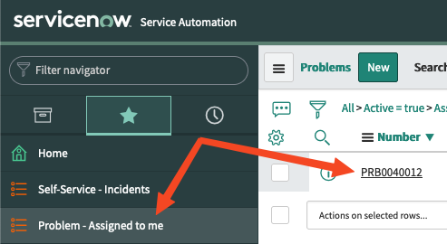

A problem represents the cause of one or more incidents. The root cause of the problem may not be known at the time of creation and may require root cause analysis through the problem management process.

Another playbook has been added to your working directory in VS Code and a template has been created to attach a problem to the incident previously created.

- First, inspect the playbook called `problem-attach.yml` in the `VS Code` tab.

> Notice that this playbook will first query for existing incident numbers that you have created and will use the value returned in the task that creates the problem.

- Next, execute the new job template from Automation Controller by pressing the rocket icon next to the template `2 - Attach problem (problem-attach.yml)`.

That should have completed successfully! Go back to ServiceNow and check under your assigned problems for a new problem number:

You can also check to see if the status of the incident has been updated. There should now also be a problem referenced on the incident page.
