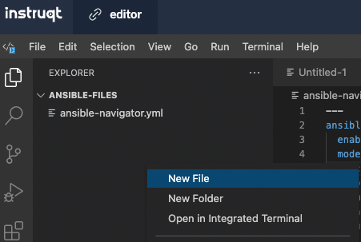

👋 Introduction
===
#### Estimated time to complete: *3 minutes*<p>
Welcome to the writing your first Ansible playbook. In the following challenges and tasks we will guide you in the creation process to get you started writing Ansible playbooks. In this challenge, you will learn about ansible-navigator and create an inventory file for a set of hosts and group them into the group labeled *web*.

☑️ Task 1 - What is Ansible Navigator?
===

Ansible navigator is a command based tool for creating, reviewing and troubleshooting Ansible content. This includes inventories, playbooks, and collections.

In the following challenges ahead you will use `ansible-navigator` to run Ansible playbooks.

☑️ Task 2 - Creation of Inventory file
===
* The *editor* tab is open by default.

An inventory file is a text file that specifices the nodes that will be managed by the control machine. The nodes to be managed may include a list of hostnames or IP addresses of those nodes. The inventory file allows for nodes to be organized into groups by declaring a host group name within square brackets ([]).

You'll see one folder labeled `ansible-files` in the left pane. This folder will contain our inventory file and future playbooks.

Currently, the one file residing in the `ansible-files` directory is the `ansible-navigator.yml`. The `ansible-navigator.yml` file contains all the settings to properly run this lab. Feel free to investigate but please don't make any changes.

Within the editor tab, open the directory `ansible-files`. In that directory, right click and create the file `hosts`.



Within the file hosts, supply the following content:

```
[web]
node1
node2
```

☑️ Task 3 - How to use Ansible Navigator?
===

Ansible navigator comes with an interactive mode by default that allows you to explore the different options. Within this lab, we set the mode of `ansible-navigator` to `stdout`.

Within the *control* tab, change to the `ansible-files` directory and run the following commands to get a listing of what is available within our inventory, run:

```
cd ansible-files
```

```
ansible-navigator inventory --list
```

If the `--list` is too verbose, the option of `--graph` can be used to provide a more condensed version of `--list`.

```
ansible-navigator inventory --graph
```

In following challenges you will familarize yourself with the `ansible-navigator run` command that allows us to run Ansible playbooks.


✅ Next Challenge
===
Press the `Check` button below to go to the next challenge once you’ve completed the task.

🐛 Encountered an issue?
====

If you have encountered an issue or have noticed something not quite right, please [open an issue](https://github.com/ansible/instruqt/issues/new?labels=writing-first-playbook&title=Issue+with+Writing+First+Playbook+slug+ID:+playbook-inventory&assignees=rlopez133).

<style type="text/css" rel="stylesheet">
  .lightbox {
    display: none;
    position: fixed;
    justify-content: center;
    align-items: center;
    z-index: 999;
    top: 0;
    left: 0;
    right: 0;
    bottom: 0;
    padding: 1rem;
    background: rgba(0, 0, 0, 0.8);
    margin-left: auto;
    margin-right: auto;
    margin-top: auto;
    margin-bottom: auto;
  }
  .lightbox:target {
    display: flex;
  }
  .lightbox img {
    /* max-height: 100% */
    max-width: 60%;
    max-height: 60%;
  }
  img {
    display: block;
    margin-left: auto;
    margin-right: auto;
  }
  h1 {
    font-size: 18px;
  }
    h2 {
    font-size: 16px;
    font-weight: 600
  }
    h3 {
    font-size: 14px;
    font-weight: 600
  }
  p span {
    font-size: 14px;
  }
  ul li span {
    font-size: 14px
  }
</style>
